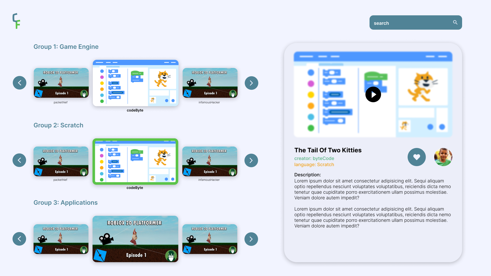

# coder_fair
## User
Represents a user object
- role - value based from 1-5; This indicates the weight of your vote | **INT**
- coderName - non PII (should it be tied to a private file so we know who is who?) | **STRING**
****
## Student
Represents a student object
- coderName - refer [[#User]]
- profilePictureURL - where should we store this? (Few options include Deta Base for simplicity also an option of Firebase, however this option might take too ) | **STRING**
- listOfProjects - will contain a list of [[#Project]]s | **List\<Project>**
- codeCoach - name of coach |  **STRING**
- thumbnailURL - image URL of game to put on the [[HOME SCREEN]] card (Chose this instead of option to display profile picture of student because: 1. more visually appealing 2. removes any bias towards a project; refer https://stackoverflow.com/questions/12788287/how-to-get-hq-youtube-thumbnails) | **STRING**
****
## Project
Represents a project object

- title - title of the game or application | **STRING**
- videoURL - youtube video id or full url (refer https://pub.dev/packages/youtube_player_iframe as this will be the primary widget we will be using to display the video) | **STRING**
- language - coding language used for the project | **STRING**
- description - a synopsis of the project | **STRING**
****
## WidgetController
This will be the class that will be used to control the widget that is currently being displayed in either the right side panel (web) or the dialog box (mobile)
- **TBD**

****
## Screens
Web Home Screen

****
Web Error Screen

****
Mobile Home Screen

****
Mobile Error Screen

****
Mobile Overlay Widget

****
